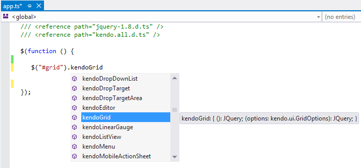

# TypeScript

Kendo UI provides a [TypeScript](http://www.typescriptlang.org/) definitions file which enables strongly-typed access to the Kendo UI components and their configuration.

## Getting Started

You can install TypeScript either by using the redistributable package or NPM.

### Using the Redistributable Package

Each Kendo UI distribution includes a `typescript` directory which contains a `.d.ts` file, i.e. `kendo.all.d.ts`. Copy this file to your project and in your TypeScript file add a reference to it as demonstrated below:

    /// <reference path="kendo.all.d.ts" />

You can optionally include the latest jQuery TypeScript definition file as well.

    /// <reference path="jquery-1.8.d.ts" />
    /// <reference path="kendo.all.d.ts" />

### Using NPM

When you install Kendo UI for jQuery through NPM, the package already includes all TypeScript definition files. No additional installation is required. After running:
```
    npm install --save @progress/kendo-ui

```
the TypeScript definitions (including all.d.ts) are available directly inside the installed NPM package.

## Features

* Getting instances of existing components

    

* Initializing and configuring components

    

* Initializing the Kendo UI DataSource

    

* Creating components through TypeScript inheritance&mdash;The following example demonstrates how to inherit from an existing Kendo UI component.

```
/// <reference path="jquery.d.ts" />
/// <reference path="kendo.all.d.ts" />

module KendoWidgets {
    // (Optional) Extend the default component options.
    export interface MyDatePickerOptions extends kendo.ui.DatePickerOptions {
    }

    // Create a class which inherits from the Kendo UI component.
    export class MyDatePicker extends kendo.ui.DatePicker {
        constructor(element: Element, options?: MyDatePickerOptions) {
            super(element, options);
        }
        // (Optional) Override a component method.
        open() {
            // Log to the console (optional).
            console.log("open");

            // Invoke a base component method.

            super.open();
        }
    }
    // Create an alias of the prototype (required by kendo.ui.plugin).
    MyDatePicker.fn = MyDatePicker.prototype;
    // Deep clone the component default options.
    MyDatePicker.fn.options = $.extend(true, {}, kendo.ui.DatePicker.fn.options);
    // Specify the name of your Kendo UI component. Used to create the corresponding jQuery plugin.
    MyDatePicker.fn.options.name = "MyDatePicker";
    // Create a jQuery plugin.
    kendo.ui.plugin(MyDatePicker);
}
// Expose the newly created jQuery plugin to TypeScript.
interface JQuery {
    kendoMyDatePicker(options?: kendo.ui.DatePickerOptions): JQuery;
}
$(function () {
    // Initialize your custom component.
    $("#datepicker").kendoMyDatePicker();
    // Get a reference to the component instance.
    var myDatePicker = <KendoWidgets.MyDatePicker>$("#datepicker").data("kendoMyDatePicker");
    // Call a component method.
    myDatePicker.open();
});
```

* Using Kendo UI MVVM in TypeScript&mdash;When inheriting from `kendo.data.ObservableObject` in TypeScript you should call the `super.init` method to properly set up dependency tracking. The following example shows how to use Kendo UI MVVM in TypeScript.

```
/// <reference path="jquery.d.ts" />
/// <reference path="kendo.all.d.ts" />

class Person extends kendo.data.ObservableObject {
    name = "John Doe";

    constructor() {
        super();

        super.init(this);
    }
}

class ViewModel extends kendo.data.ObservableObject {
    person = new Person();

    constructor() {
        super();

        super.init(this);
    }
}

$(function () {
    var viewModel = new ViewModel();

    kendo.bind(document.body, viewModel);

    viewModel.set("person.name", "Jane Doe");
});
```

## See Also

* [MVVM Pattern Overview]()
* [Installing with NPM]()
