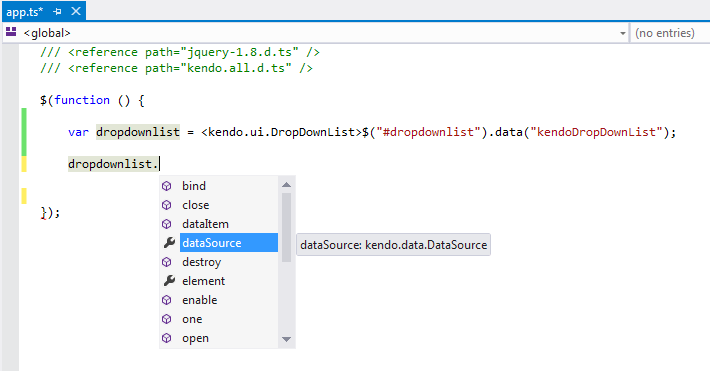
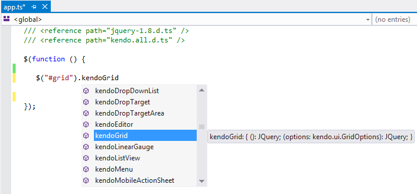
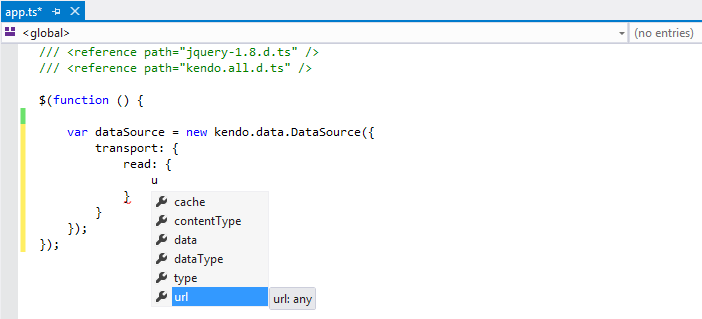

# TypeScript

Kendo UI provides a [TypeScript](http://www.typescriptlang.org/) definitions file which enables strongly-typed access to the Kendo UI widgets and their configuration.

## Getting Started

You can install TypeScript either by using the redistributable package or NPM.

### Using the Redistributable Package

Each Kendo UI distribution includes a `typescript` directory which contains a `.d.ts` file, i.e. `kendo.all.d.ts`. Copy this file to your project and in your TypeScript file add a reference to it as demonstrated below:

    /// <reference path="kendo.all.d.ts" />

You can optionally include the latest jQuery TypeScript definition file as well.

    /// <reference path="jquery-1.8.d.ts" />
    /// <reference path="kendo.all.d.ts" />

### Using NPM

Since the Kendo UI TypeScript definitions are available in the [DefinitelyTyped](http://definitelytyped.org/) project, they are also available as an [npm package](https://www.npmjs.com/package/@types/kendo-ui). To include them in your project, run the `npm install --save @types/kendo-ui` command.

## Features

* Getting instances of existing widgets

    

* Initializing and configuring widgets

    

* Initializing the Kendo UI DataSource

    

* Creating widgets through TypeScript inheritance&mdash;The following example demonstrates how to inherit from an existing Kendo UI widget.

      /// <reference path="jquery.d.ts" />
      /// <reference path="kendo.all.d.ts" />

      module KendoWidgets {
          // (Optional) Extend the default widget options.
          export interface MyDatePickerOptions extends kendo.ui.DatePickerOptions {
          }

          // Create a class which inherits from the Kendo UI widget.
          export class MyDatePicker extends kendo.ui.DatePicker {
              constructor(element: Element, options?: MyDatePickerOptions) {
                  super(element, options);
              }
              // (Optional) Override a widget method.
              open() {
                  // Log to the console (optional).
                  console.log("open");

                  // Invoke a base widget method.

                  super.open();
              }
          }
          // Create an alias of the prototype (required by kendo.ui.plugin).
          MyDatePicker.fn = MyDatePicker.prototype;
          // Deep clone the widget default options.
          MyDatePicker.fn.options = $.extend(true, {}, kendo.ui.DatePicker.fn.options);
          // Specify the name of your Kendo UI widget. Used to create the corresponding jQuery plugin.
          MyDatePicker.fn.options.name = "MyDatePicker";
          // Create a jQuery plugin.
          kendo.ui.plugin(MyDatePicker);
      }
      // Expose the newly created jQuery plugin to TypeScript.
      interface JQuery {
          kendoMyDatePicker(options?: kendo.ui.DatePickerOptions): JQuery;
      }
      $(function () {
          // Initialize your custom widget.
          $("#datepicker").kendoMyDatePicker();
          // Get a reference to the widget instance.
          var myDatePicker = <KendoWidgets.MyDatePicker>$("#datepicker").data("kendoMyDatePicker");
          // Call a widget method.
          myDatePicker.open();
      });

* Using Kendo UI MVVM in TypeScript&mdash;When inheriting from `kendo.data.ObservableObject` in TypeScript you should call the `super.init` method to properly set up dependency tracking. The following example shows how to use Kendo UI MVVM in TypeScript.

      /// <reference path="jquery.d.ts" />
      /// <reference path="kendo.all.d.ts" />

      class Person extends kendo.data.ObservableObject {
          name = "John Doe";

          constructor() {
              super();

              super.init(this);
          }
      }

      class ViewModel extends kendo.data.ObservableObject {
          person = new Person();

          constructor() {
              super();

              super.init(this);
          }
      }

      $(function () {
          var viewModel = new ViewModel();

          kendo.bind(document.body, viewModel);

          viewModel.set("person.name", "Jane Doe");
      });

## See Also

* [SharePoint Add-Ins]()
* [Twitter Bootstrap]()
* [Angular 2.0]()
* [RequireJS]()
* [Visual Studio IntelliSense]()
* [Telerik Data Access]()
* [SystemJS Support]()
* [Webpack Support]()
* [Aurelia]()
