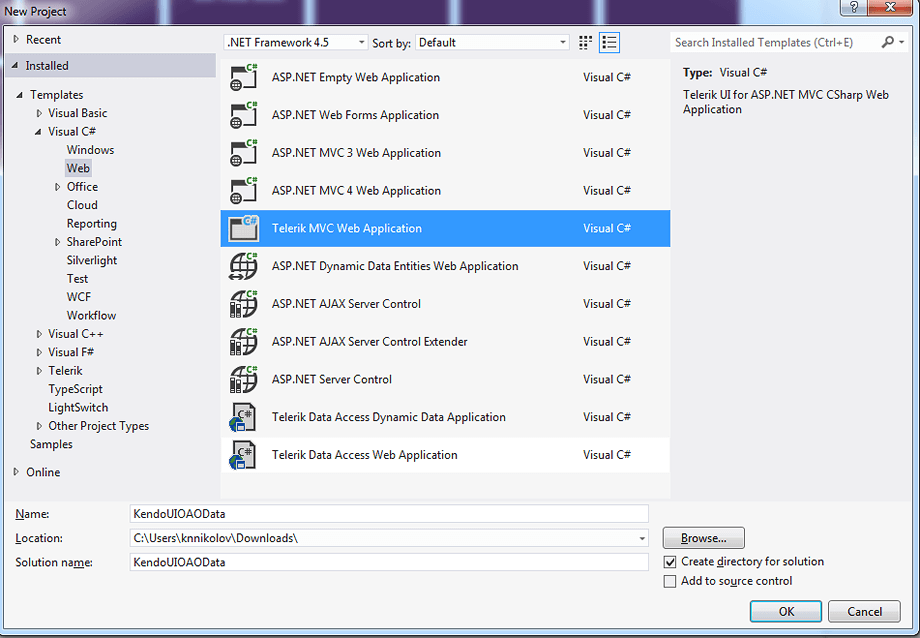
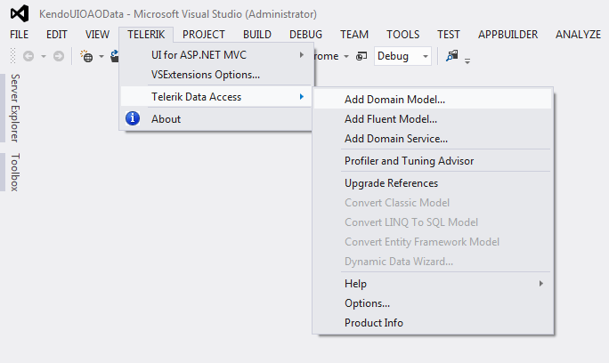
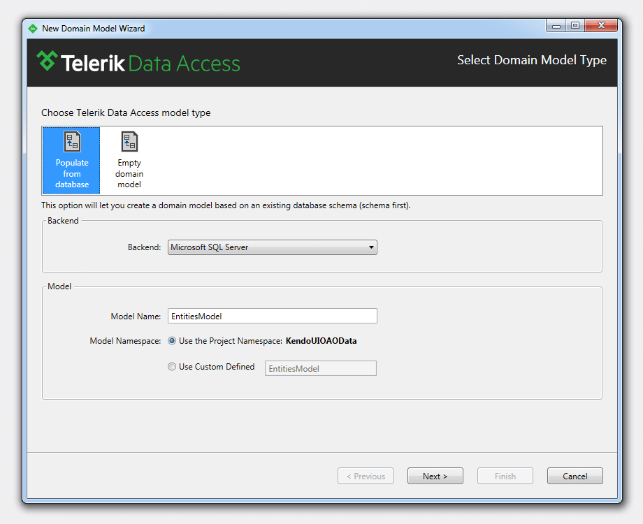
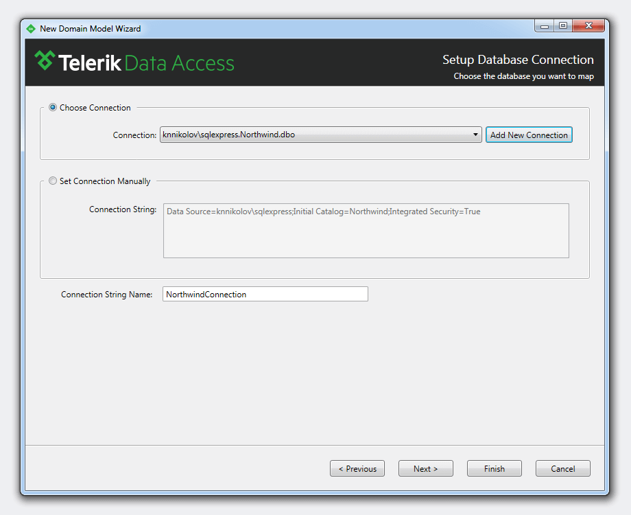
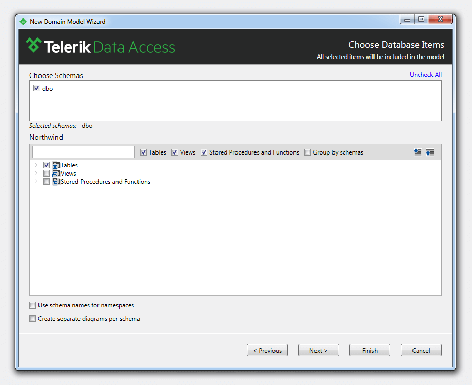
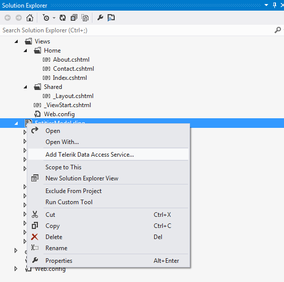
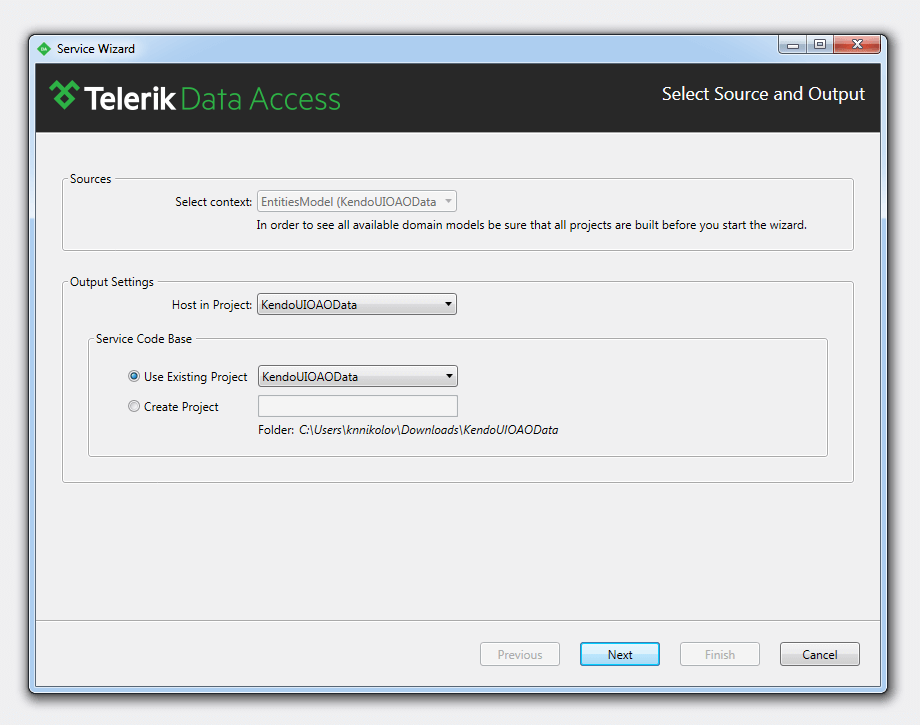
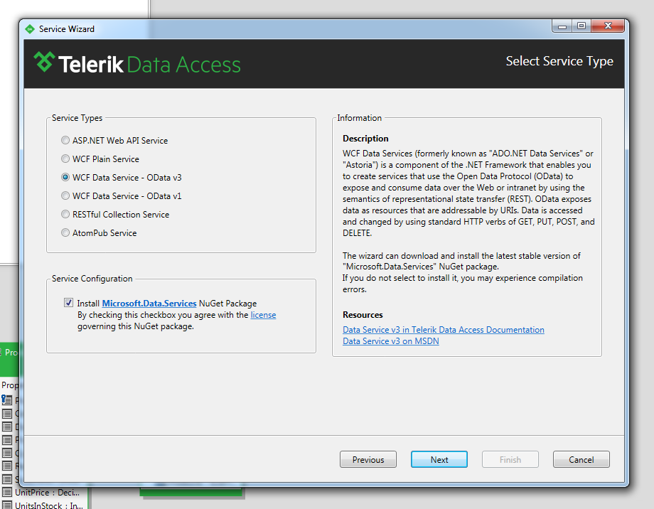
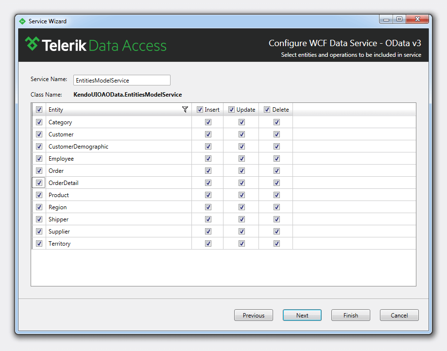
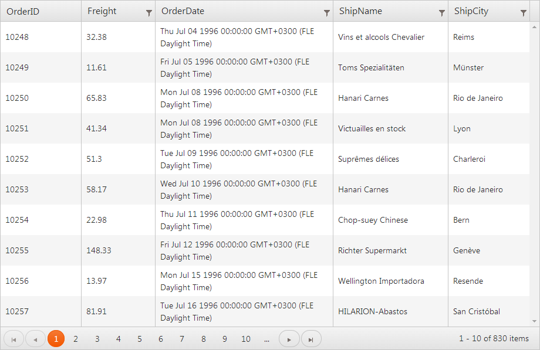

# Telerik Data Access

This article demonstrates how to leverage [Telerik Data Access](https://www.telerik.com/data-access) on the backend and let [Kendo UI](https://www.telerik.com/kendo-ui) take care of the user interface.

## Setting Up the Project

To get started, create a new Telerik MVC Web Application.

When asked about the Data Access approach, select **Skip Creating a Telerik Data Access Model Library Project**. This is going to create an empty Telerik UI for an MVC project.

## Building the Model

1. To build a Data Access data model, select **TELERIK** > **Telerik Data Access** > **Add Domain Model**, as shown below.

    > If you do not have Telerik Data Access installed, you are able to get the trial edition on the [Free Trials page](https://www.telerik.com/download-trial-file.aspx?pid=638).

    

1. On the window that opens next, select **Populate from database**. Click **Next**.

    

1. Set up a connection to NorthwindOA, installed with Data Access, by choosing the option from the drop-down list. Click **Next**.

    

1. Include all tables from the database in the data model by ticking the **Tables** check box.

    

1. Click **Finish**. The data model is now ready to be used. Next, you need to expose this data model through a service layer.

## Building the Service Layer

1. Perform a build on the application. Right-click the `.rlinq` file in **Solution Explorer**. Select **Add Telerik Data Access Service** so that the domain service wizard fires up.

    

1. From the drop-down list of the wizard select **EntitiesModel**. Click **Next**.

    

1. The screen that loads next allows you to configure the service that is going to be created. Select **WCF Service - OData v3** and click **Next**.

    

1. On the next screen you are able to change the name of the service and select which tables to include. Click **Finish** to create your service.

    

## Connecting oData to the Grid

Now configure the front end. Wire up the Orders to a Kendo UI Grid. Kendo UI is a very rich and powerful framework that provides you with full control over the UI of your project, so make sure you explore it even further.

1. Edit the `Global.asax.cs` file and add the following route configuration in the `RegisterRoutes` method:

    RouteTable.Routes.IgnoreRoute("EntitiesModelService.svc/{*pathInfo}"); // specify the correct service path here

1. Set up the Grid widget. For detailed information on how to configure data binding, visit the [Kendo UI live demo page](https://demos.telerik.com/kendo-ui/web/grid/index.html). Basically, use a `div` that is going to be applied as the container for the Grid and configure the widget in script.

The following example demonstrates some sample code you need.

    <!--Will be turned into a Kendo UI Grid! -->
    

    <!-- configure the Grid-->
    

1. Run the application. The following screenshot demonstrates the Grid you are expected to see as a result.

    

## See Also

* [SharePoint Add-Ins]()
* [Twitter Bootstrap]()
* [Angular 2.0]()
* [RequireJS]()
* [TypeScript]()
* [Visual Studio IntelliSense]()
* [SystemJS Support]()
* [Webpack Support]()
* [Aurelia]()
