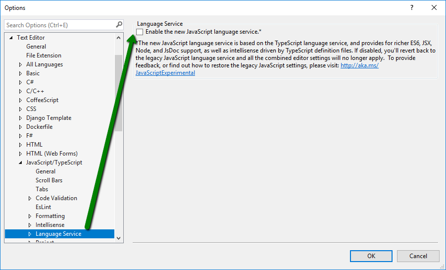
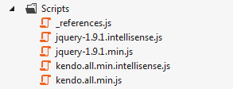
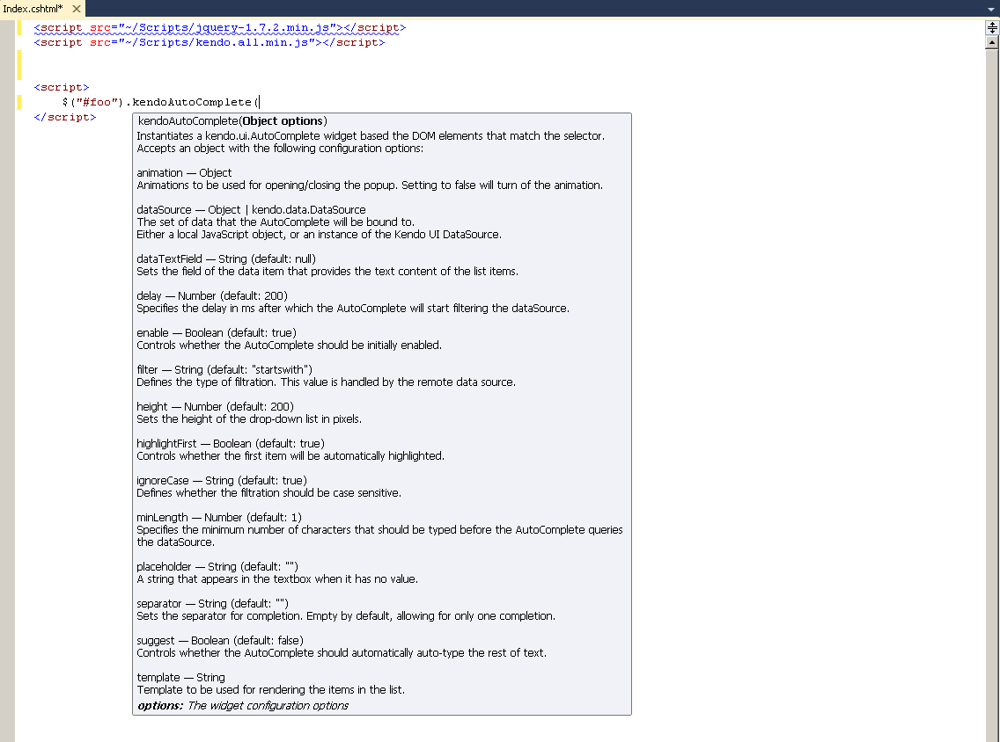
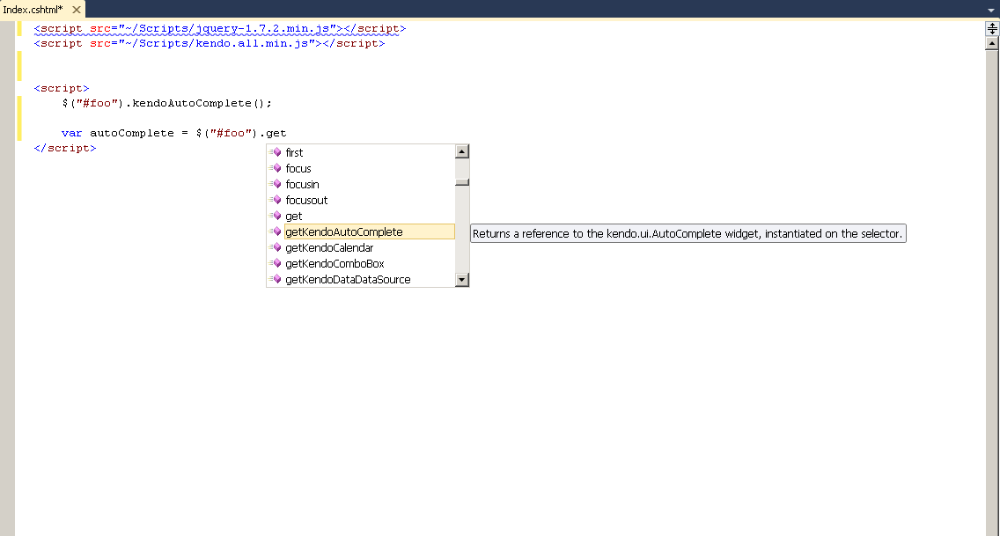
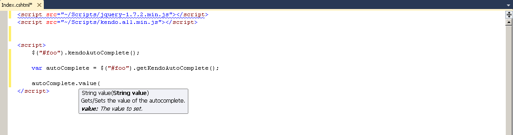
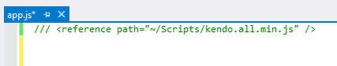
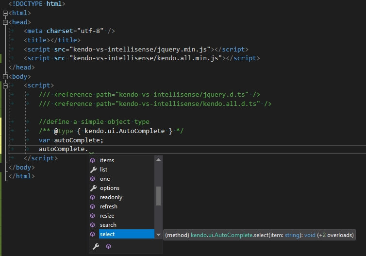
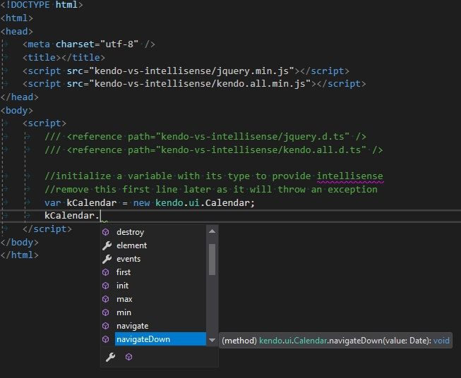

# Visual Studio IntelliSense

Kendo UI provides Intelligent code completion for Visual Studio (VS) by using an additional `vsdoc` or `intellisense` JavaScript file.

The approach was initially described in Scott Guthrie's blog post [jQuery IntelliSense in VS 2008](http://weblogs.asp.net/scottgu/archive/2008/11/21/jquery-intellisense-in-vs-2008.aspx). Kendo UI Visual Studio IntelliSense is integrated in Visual Studio 2008 SP1 or later versions and it also works with Visual Web Developer (free).

For versions of Visual Studio prior to Visual Studio 2017, refer to the [section on installation](#installation).

## VS 2017

As of the Visual Studio 2017 release, Microsoft use a [new language service for JavaScript IntelliSense](https://docs.microsoft.com/en-us/visualstudio/ide/javascript-intellisense?view=vs-2017) that is based on TypeScript. This means that the `-vsdoc.js` files are no longer read and supported for JavaScript IntelliSense and that to get IntelliSense for non-standard object types including custom widgets like the Kendo UI widgets, you need to treat it like a strongly typed language.

For more information on this service, the way it works, and the features it supports, refer to:
* [Microsoft/TypeScript GitHub repo wiki: JavaScript Language Service in Visual Studio](https://github.com/Microsoft/TypeScript/wiki/JavaScript-Language-Service-in-Visual-Studio)
* [Microsoft/TypeScript GitHub repo wiki: JSDoc Support in JavaScript](https://github.com/Microsoft/TypeScript/wiki/JsDoc-support-in-JavaScript)

With this in mind, you may want to consider writing directly in TypeScript and using the [TypeScript definitions for Kendo UI]().

To get the VSDoc-based IntelliSense, you can try to revert to the previous behavior by going to **Tools** > **Options** > **Text Editor** > **JavaScript/TypeScript** > **Language Service** and uncheck the checkbox under **Enable the new JavaScript Language service**. To enforce the changes, restart Visual Studio.

By utilizing the suggested approach, you can use the JavaScript documentation provided in the `vsdoc` files as demonstrated in the [following section on installation](#installation).

Alternatively, you can also use the TypeScript definitions in JavaScript code by utilizing the JSDoc syntax as demonstrated in the [followign section on JSDoc Syntax for TypeScript-based Intellisense](#jsdoc-syntax-for-typescript-based-intellisense).

## Installation

Each bundle package includes a `vsdoc` directory which contains a `vsdoc.js` and an `intellisense.js` file for JavaScript.

* For Visual Studio 2008 SP1 and Visual Studio 2019, place the `vsdoc.js` file next to the `kendoui` bundle script.
* For Visual Studio 2012 and later, place the `intellisense.js` file next to the `kendoui` bundle script.

Make sure the naming prefix of the IntelliSense file matches the `kendoui` bundle name.

- Visual Studio 2008 SP1 - 2010

    

- Visual Studio 2012 and later

    

- Visual Studio 2017

    For Visual Studio 2017, you must disable its TypeScript-based Intellisense in order for this to work. See the [Visual Studio 2017](#visual-studio-2017) section.

## Features

* Options for widget initialization

    

* Widget accessors

    

* Widget methods

    

## Reference

To reference the IntelliSense, use either of the following approaches:

* Reference the Kendo UI Visual Studio IntelliSense when the script is directly added to a page as previously demonstrated. The `kendo.all-vsdoc.js` and `kendo.all.min.intellisense.js` files are also available on the [Kendo UI CDN]() in the same folder as the regular JavaScript files.
* Reference the IntelliSense by using a reference hint from within an external JavaScript file as demonstrated in the following screenshot. This approach may not work in Visual Studio 2017 and later.

    

## JSDoc Syntax for TypeScript-Based Intellisense

With the TypeScript-based IntelliSense in Visual Studio 2017, you can use TypeScript definitions to get IntelliSense with the default TypeScript-based IntelliSense mode. In this way, you will not have to disable the new language service and affect other parts of your workflow. This approach and the `vsdoc`-based IntelliSense may not work and you might have to prune the code before executing it.

The following screenshot demonstrates how to add TypeScript references to a JavaScript code block.

The following screenshots demonstrate how to declare variable types with [JSDoc syntax](https://github.com/Microsoft/TypeScript/wiki/JsDoc-support-in-JavaScript).

## See Also

* [SharePoint Add-Ins]()
* [Twitter Bootstrap]()
* [Angular 2.0]()
* [RequireJS]()
* [TypeScript]()
* [Telerik Data Access]()
* [SystemJS Support]()
* [Webpack Support]()
* [Aurelia]()
