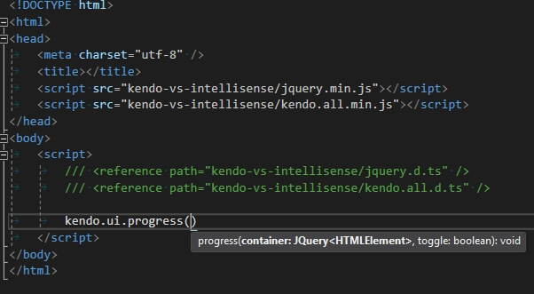

# Visual Studio IntelliSense

Kendo UI provides Intelligent code completion for Visual Studio by using an additional `vsdoc` or `intellisense` JavaScript file. The approach was initially described in Scott Guthrie's blog post [jQuery IntelliSense in VS 2008](http://weblogs.asp.net/scottgu/archive/2008/11/21/jquery-intellisense-in-vs-2008.aspx). Kendo UI Visual Studio IntelliSense is integrated in Visual Studio 2008 SP1 or later versions and it also works with Visual Web Developer (free).

For versions of Visual Studio prior to Visual Studio 2017, go to the [Installation](#installation) section.

## Visual Studio 2017

As of Visual Studio 2017, Microsoft use a [new language service for JavaScript Intellisense](https://docs.microsoft.com/en-us/visualstudio/ide/javascript-intellisense?view=vs-2017) that is based on TypeScript. This means that `-vsdoc.js` files are no longer read and supported for JavaScript intellisense and you need to treat it like a strongly typed language in order to get Intellisense for non-standard object types, including custom widgets like the Kendo UI widgets.

You can read more about this service, how it works and what features it supports in the following articles:

* [Microsoft/TypeScript GitHub repo wiki: JavaScript Language Service in Visual Studio](https://github.com/Microsoft/TypeScript/wiki/JavaScript-Language-Service-in-Visual-Studio)

* [Microsoft/TypeScript GitHub repo wiki: JSDoc support in JavaScript](https://github.com/Microsoft/TypeScript/wiki/JsDoc-support-in-JavaScript)

With this in mind, you may want to consider writing directly in TypeScript and using the [TypeScript Definitions for Kendo UI]().

To get the VSDoc-based IntelliSense, you can try to revert to the old behavior by going to **Tools** > **Options** > **Text Editor** > **JavaScript/TypeScript** > **Language Service** and **uncheck** the checkbox from **Enable the new JavaScript Language service**. Make sure to restart Visual Studio for the changes to take effect.

With this, you can use the old JavaScript documentation provided in the `vsdoc` files as shown in the [Installation](#installation) section below.

Alternatively, you can also try using the TypeScript definitions in JavaScript code by utilizing the JSDoc syntax as shown in the [JSDoc Syntax for TypeScript-based Intellisense](#jsdoc-syntax-for-typescript-based-intellisense) section below.

## Installation

Each bundle package contains a `vsdoc` directory, which contains a `vsdoc.js` and `intellisense.js` files for JavaScript.

For Visual Studio 2008 SP1 and Visual Studio 2019, put the `vsdoc.js` file next to the `kendoui` bundle script, 

For Visual Studio 2012 and later, put the `intellisense.js` file next to the `kendoui` bundle script.

Make sure the naming prefix of the intellisense file matches the `kendoui` bundle name.

- Visual Studio 2008 SP1 - 2010

    

- Visual Studio 2012 and later

    
    
- Visual Studio 2017

    For Visual Studio 2017, you must disable its TypeScript-based Intellisense in order for this to work. See the [Visual Studio 2017](#visual-studio-2017) section.

## Features

### Options for Widget Initialization

### Widget Accessors

### Widget Methods

## Reference

There are two ways to reference the IntelliSense:

* Reference the Kendo UI Visual Studio IntelliSense when the script is directly added to a page as shown above. The `kendo.all-vsdoc.js` and `kendo.all.min.intellisense.js` files are also available on the [Kendo UI CDN]() in the same folder as the regular JavaScript files.
* Reference the IntelliSense by using a reference hint from within an external JavaScript file as shown below. Note that this may no longer work as of Visual Studio 2017.

    
    
## JSDoc Syntax for TypeScript-based Intellisense

With the TypeScript-based intellisense in Visual Studio 2017, you can try using TypeScript definitions to get intellisense with the default TypeScript-based IntelliSense mode so you don't have to disable the new language service and affect other parts of your workflow. 

Note that it may not work as well as the vsdoc-based intellisense and you may have to prune the code before executing it. Nevertheless, here are a few examples:

* adding TypeScript references to a JavaScript code block:

    

* declaring variable types with [JSDoc syntax](https://github.com/Microsoft/TypeScript/wiki/JsDoc-support-in-JavaScript)

    
 
    

## See Also

* [SharePoint Add-Ins]()
* [Twitter Bootstrap]()
* [Angular 2.0]()
* [RequireJS]()
* [TypeScript]()
* [Telerik Data Access]()
* [SystemJS Support]()
* [Webpack Support]()
* [Aurelia]()
