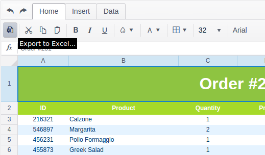

# Exporting the Spreadsheet to Excel (.xlsx)

The Spreadsheet component utilizes the [Excel export module](/framework/excel/introduction) framework to produce Excel files directly in the browser.

The output files are in the OOXML Spreadsheet format with an `.xlsx` extension. The legacy `.xls`, binary format is not supported.

# User Interface

The default toolbar configuration includes an **Excel Export** button. Clicking on it opens a dialog box for entering the file name.

# Export API

The Spreadsheet client-side API includes the [saveAsExcel](/api/javascript/ui/spreadsheet#methods-saveAsExcel) method for initiating export via JavaScript.

This method will not ask the user for a file name. Instead, it will the value set in [excel.fileName](/api/javascript/ui/spreadsheet.html#configuration-excel.fileName).

# Limitations and Known Issues

Currently, the export module does not handle:
* Filtering and Sorting
* Border styles

These will be addressed before the widget goes out of Beta.
